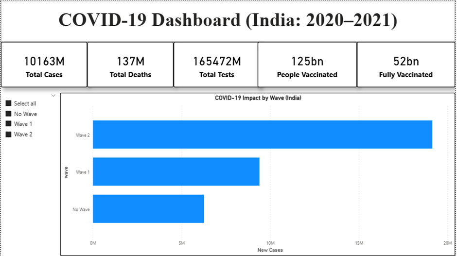
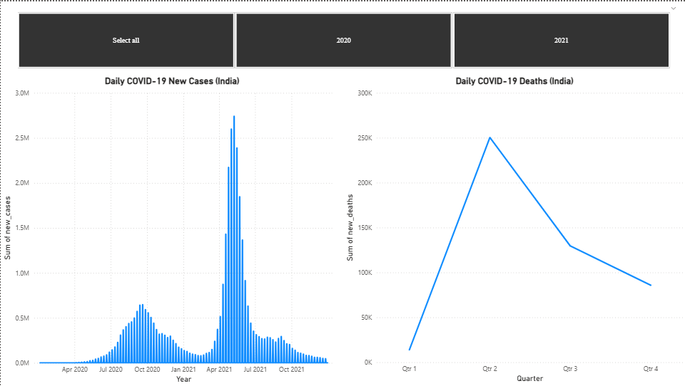
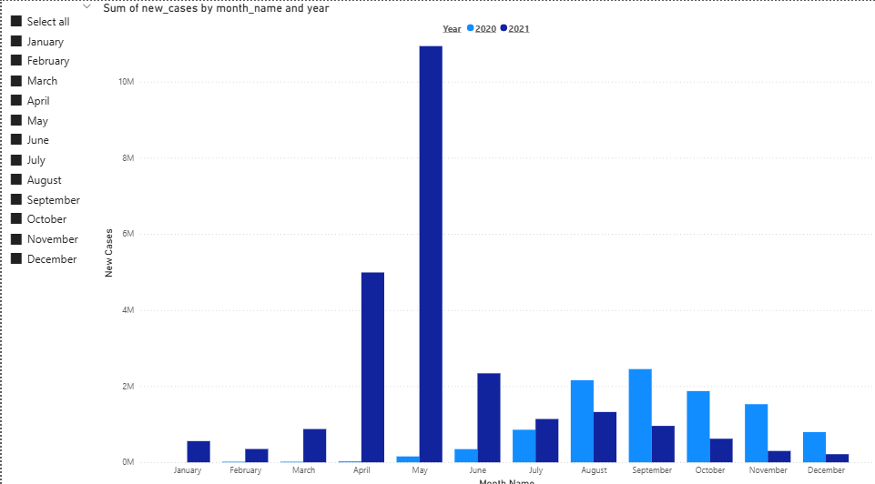

COVID-19 India Dashboard (2020–2021)

A complete end-to-end data analysis and interactive dashboard project analyzing the COVID-19 pandemic in India from January 2020 to December 2021, built using Python (Pandas + Jupyter Notebook) and Power BI.

This project is part of a Data Analytics workflow containing:

Data Cleaning & Transformation
Feature Engineering
Multi-level Aggregations
KPI Calculations
Interactive Power BI Visualizations
Insights & Dashboard Explanation

Project Repository

🔗 https://github.com/suhas781/COVID19-India-Dashboard

Project Overview

India reported a large number of COVID-19 cases across two major waves (2020 & 2021).
This project analyzes:
Daily case & death trends
Monthly comparison between 2020 and 2021
Wave-wise impact
Vaccination progress
National-level KPIs
Relationship between testing, vaccination, and cases

The goal is to derive clear, visual insights and build a professional dashboard usable for reporting and data-driven decision making.

Folder Structure

COVID19-India-Dashboard/
│
├── data/
│ ├── covid_india_daily.csv
│ ├── covid_india_monthly.csv
│ ├── covid_india_waves.csv
│ ├── covid_india_yearly.csv
│ └── owd-covid-data.csv
│
├── notebook/
│ └── covid_analysis.ipynb
│
├── power_bi/
│ └── covid_dashboard.pbix
│
└── README.md

Tech Stack

| Component       | Technology               |
| --------------- | ------------------------ |
| Programming     | Python, Pandas, NumPy    |
| Notebook        | Jupyter Notebook         |
| Visualization   | Power BI                 |
| Version Control | Git & GitHub             |
| Data Source     | Our World in Data (OWID) |

Dashboard Pages

Below is the proper order (Page 1 → Page 2 → Page 3) with detailed explanation for each screenshot.

PAGE 1 — KPI Summary + Wave Impact Overview

Screenshot

What This Page Shows

Top-Level KPIs
Total Cases: 10M+
Total Deaths: 137K
Total Tests: 165M+
People Vaccinated: 125B
Fully Vaccinated: 52B

These KPIs provide a quick national snapshot.

Wave-Wise New Case Impact (Bar Chart)

Displays cumulative new cases for:
Wave 1
Wave 2
No Wave period

Key Observation:
Wave 2 had the highest impact (~20M+ cases), followed by Wave 1.

Slicer: Wave Filter

Allows filtering visuals by:

No Wave
Wave 1
Wave 2

Useful for comparative analysis.

PAGE 2 — Daily Trends (Cases & Deaths)
Screenshot

What This Page Shows
Daily New Cases (2020–2021)

A continuous bar chart showing:
Rise of cases in first wave (July–October 2020)
Sharp spike in second wave (April–June 2021)
Decline toward end of 2021

Daily Deaths by Quarter
Line chart summarizing deaths per quarter.

Observation:
Q2 of 2021 shows the highest deaths (peak of second wave).

Year Filter

Allows switching between:
2020
2021
Combined view

PAGE 3 — Monthly Comparison (2020 vs 2021)

Screenshot

What This Page Shows

Monthly Case Comparison
A side-by-side 2020 vs 2021 bar comparison for each month.

Insights:

2020:
September–October: Moderate peaks
Cases decline toward end of year

2021:
April–May: Extremely high cases (second wave explosion)
Matching the national surge

Month Slicer
Allows selecting any month combination to compare.

Data Preparation Summary (Python)

From your covid_analysis.ipynb, these transformations were performed:

Data Cleaning
Handled missing values (ffill())
Corrected data types
Removed invalid rows
Feature Engineering

Created new fields:

month_name
year
wave classification
death_rate
daily_case_growth
Aggregate monthly & yearly tables
Exported into 4 clean CSVs used in Power BI.

Key Insights

1) Second Wave (Apr–Jun 2021) was the most severe, with peak cases >2.7M/day.
2) Death counts peaked in Q2 2021, aligned with hospitalization pressure.
3) Vaccination rollout massively influenced case decline post-August 2021.
4) Wave 2 accounted for the largest share of total cases.
5) Monthly comparison clearly shows 2021 severity higher than 2020.
6) Testing numbers strongly correlate with case spikes.

How to Run Locally

1) Clone the repository

git clone https://github.com/suhas781/COVID19-India-Dashboard.git

2) Open Jupyter Notebook

Run data preprocessing: notebook/covid_analysis.ipynb

3) Open Power BI

Load:power_bi/covid_dashboard.pbix
The dashboard will automatically connect to the cleaned CSVs.

Author

Suhas GS
GitHub: https://github.com/suhas781
